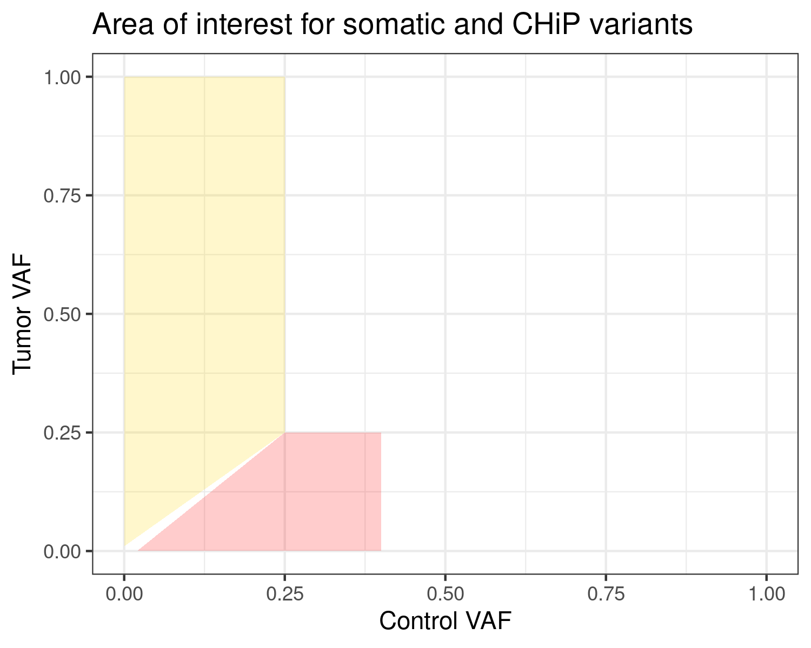
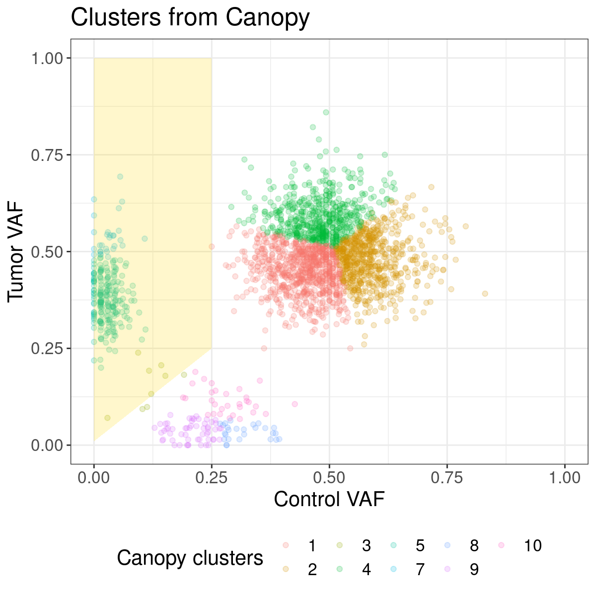
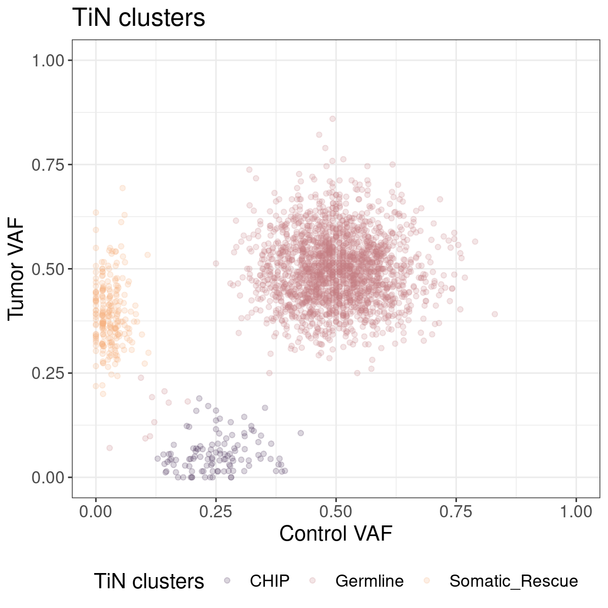
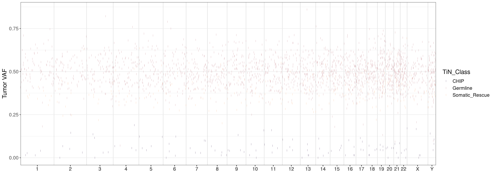
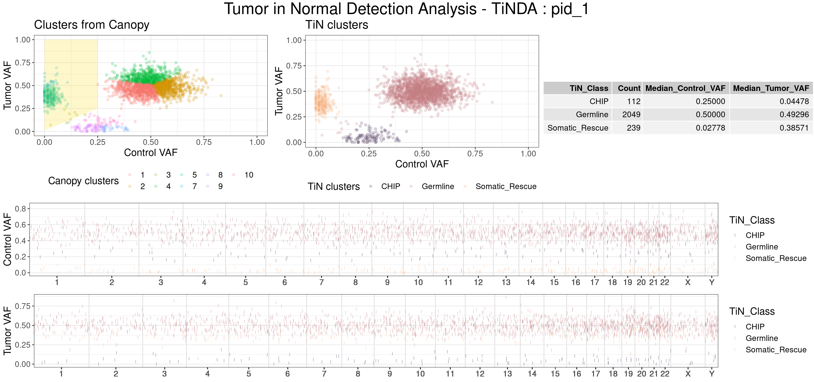

  <!-- badges: start -->
  [](https://github.com/NagaComBio/TiNDA/actions)
  <!-- badges: end -->
# TiNDA
## Tumor in Normal Detection Analysis

## Overview

This is an R package to rescue somatic variants called as germline due to tumor DNA contamination in the patient's blood/control sample.

TiNDA makes use of the [Canopy's](https://github.com/yuchaojiang/Canopy) EM-cluster function to partition the variants into different clusters. And uses the following assumptions to define these clusters into somatic and germline.

Based on the following assumptions:

1. The variant allele frequency (VAF) of somatic variants in tumor samples will be higher than contaminated somatic variants in the control sample.
2. The contamination exceeding a certain threshold (`max_control_af: 0.25`) will be difficult to separate from the germline VAF.

An area of interest (AOI) is defined in the control vs tumor VAF 2D space. Clusters with a majority (`min_clst_members: 0.85`) of its members within this AOI are defined as 'omatic rescue'.

## Area of Interest
In the tumor VAF vs control VAF, the AOI for somatic and ChiP variants are defined in the following image. The "golden" polygon defines the somatic region, and the "red" polygon defines the ChiP region, with the rest of the areas defining germline variants.




## Key Features
- **Rescuing Misclassified Variants**: TiNDA rescues somatic variants that are misclassified due to tumor-in-normal contamination.
- **Detecting CHiP Clusters**: TiNDA identifies CHiP clusters by distinguishing germline variants from genuine somatic mutations in blood.
- **Visualization**: TiNDA provides visualization tools to help users assess quality of the clustering.


## Installation

Install directly from the GitHub

```
devtools::install_github("nagacombio/tinda")
```

## Usage

#### Input data format

The input data consists of read counts of variants in both the control and tumor samples. **Important**: The variants must be prefiltered to remove SNPs and technical artifacts. Thus the final input will include all variants that are rare in the population, encompassing both somatic and rare germline variants. If the dataset is still too large and to expedite clustering and plotting, consider using only exonic variants.

The input data for TiNDA is a data frame containing the following information/columns, 

  * **CHR** - Chromosome name
  * **POS** - Variant position
  * **Control_ALT_DP** - Read depth of the variant's alternate allele in the control sample
  * **Control_DP** - Total read depth of the variant in the control sample
  * **Tumor_ALT_DP** - Read depth of the variant's alternate allele in the tumor sample
  * **Tumor_DP** - Total read_depth of the variant in the tumor sample

**Note:** Keep the column names in the input table.

An example table,

|CHR| POS | Control_ALT_DP | Control_DP | Tumor_ALT_DP | Tumor_DP
|--|--:|--:|--:|--:|--:
 1 | 1039001 | 20 | 40 | 23 | 46
 1 | 2123023 | 12 | 32 | 14 | 23
 1 | 3343543 | 23 | 56 | 34 | 67

#### Example TiNDA analysis
```{r}
# Generate data to test the package
library(TiNDA)
data(hg19_length)
test_df <- generate_test_data(hg19_length, num_variants = 500)
```

#### Run the TiNDA function

```{r}
# Check the documentation for the paramaters
tinda_object <- TiNDA(test_df)
```

#### Plotting the results
```{r}
# Plot the results of the canopy cluster analysis
canopy_clst_plot(tinda_object)
```


```{r}
# Plot the TiNDA cluster assignment
tinda_clst_plot(tinda_object)
```


```{r}
# Plot the linear plot of the TiNDA results
tinda_linear_plot(tinda_object)
```


```{r}
# Plot the summary of the TiNDA results - includes canopy clusters, TiNDA cluster assignment and linear plots
tinda_summary_plot(tinda_object)
```
